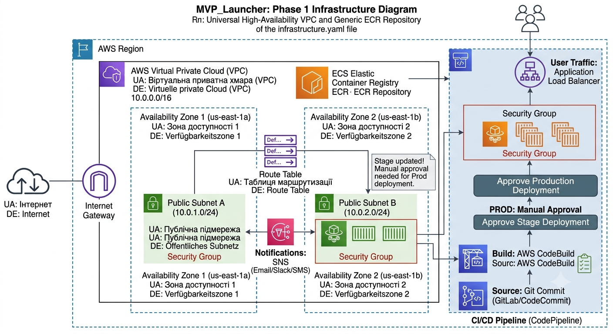

# aws-labs

# MVP_Launcher: Universal Infrastructure Layer

This repository contains reusable Infrastructure as Code (IaC) templates for launching a microservice MVP on AWS. 

## Phase 1: High-Availability VPC and Generic ECR

In this first phase, we deploy the foundational network layer and the container artifact registry.

### Architecture Diagram

### Core Components

* **Networking:** A Multi-AZ Virtual Private Cloud (VPC) with two Public Subnets for high availability. Future compute resources (like ECS Fargate) can be placed here and secured via Security Groups. Traffic is routed via an Internet Gateway.
* **Decoupled Infrastructure:** The templates use parameters for CIDR blocks, making them abstract and reusable for any project.
* **Artifact Management (ECR):** A generic Elastic Container Registry (ECR) repository named `mvp-launcher-repo`. It is engineered with:
    * **DevSecOps Security:** Image scanning on push (`ScanOnPush`) is enabled to detect vulnerabilities (CVEs).
    * **Cost Optimization:** A lifecycle policy automatically expires untagged images older than 14 days, optimizing S3 storage costs.
* **Inter-Stack Communication:** All critical resource IDs (VPC ID, Subnet IDs) are **Exported**. This allows subsequent CloudFormation stacks (Phase 2 - Compute) to dynamically import these values, removing the need for manual copy-pasting and ensuring strong infrastructure consistency.